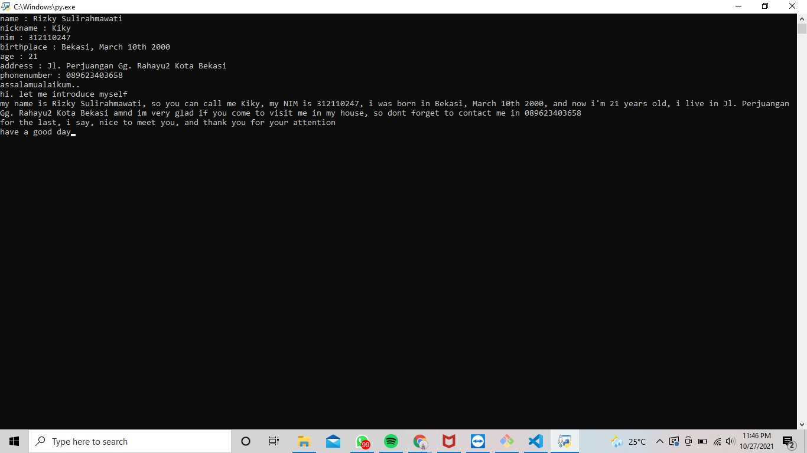
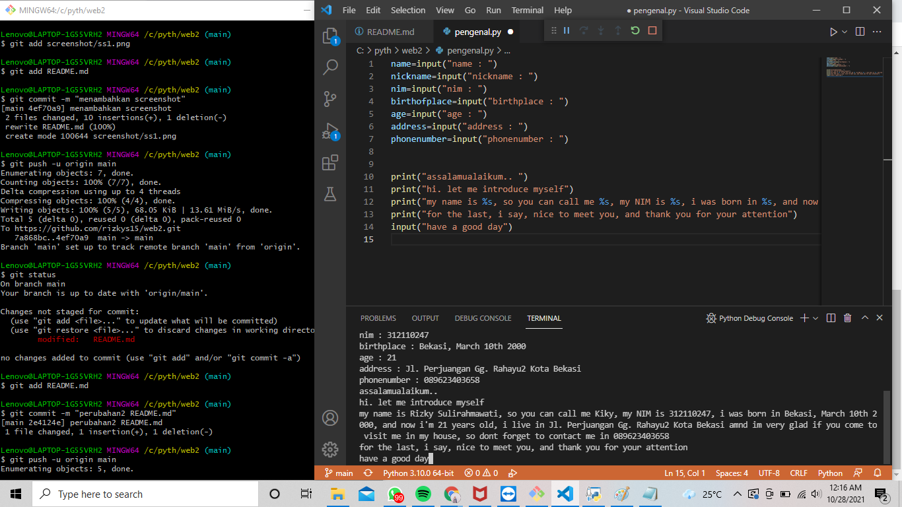

# web2
## Bahasa Pemrograman Pyhton
### VS to Python to Github By Rizky Sulirahmawati 312110247

This repository contains about simple data personality with pseudocode python

Python adalah bahasa pemrograman interpretatif multiguna. Tidak seperti bahasa lain yang susah untuk dibaca dan dipahami, python lebih menekankan pada keterbacaan kode agar lebih mudah untuk memahami sintaks. Hal ini membuat Python sangat mudah dipelajari baik untuk pemula maupun untuk yang sudah menguasai bahasa pemrograman lain.

berikut merupakan contoh tampilan python

berikut pseudocodenya

